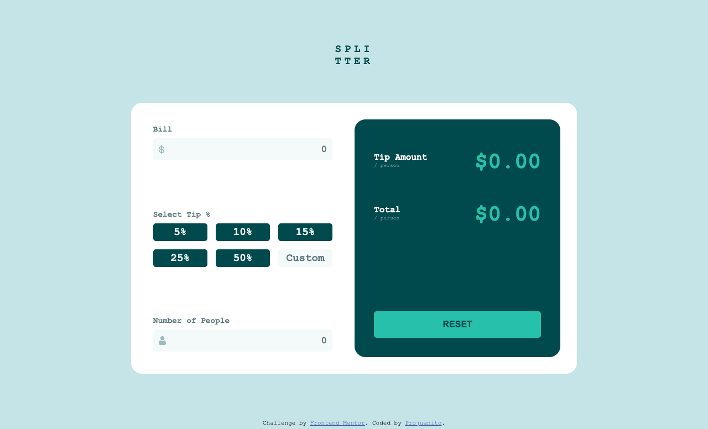

# Frontend Mentor - Tip calculator app solution

This is a solution to the [Tip calculator app challenge on Frontend Mentor](https://www.frontendmentor.io/challenges/tip-calculator-app-ugJNGbJUX). Frontend Mentor challenges help  improve coding skills by building realistic projects.

## Table of contents

- [Overview](#overview)
  - [The challenge](#the-challenge)
  - [Screenshot](#screenshot)
  - [Links](#links)
- [My process](#my-process)
  - [Built with](#built-with)
- [Author](#author)

## Overview

### The challenge

Users should be able to:

- View the optimal layout for the app depending on their device's screen size
- See hover states for all interactive elements on the page
- Calculate the correct tip and total cost of the bill per person

### Screenshot

### Links

- [solution URL](https://github.com/idrissjuanito/tip-calculator)
- [live site URL](https://idrissjuanito.github.io/tip-calculator)

## My process

### Built with

- Semantic HTML5 markup
- CSS custom properties
- Flexbox
- CSS Grid
- Desktop-first workflow
- Vanilla JS

### Useful resources

- [Mozilla Development Network](https://developer.mozilla.org/en-US/docs/Web/JavaScript) - This is main resource for learning Javascript and was very useful for this challenge.

## Author

- Website - [Pro Juanito](https://www.projuanito.com)
- Frontend Mentor - [@idrissjuanito](https://www.frontendmentor.io/profile/idrissjuanito)
- Twitter - [@idrissjuanito](https://www.twitter.com/idrissjuanito)